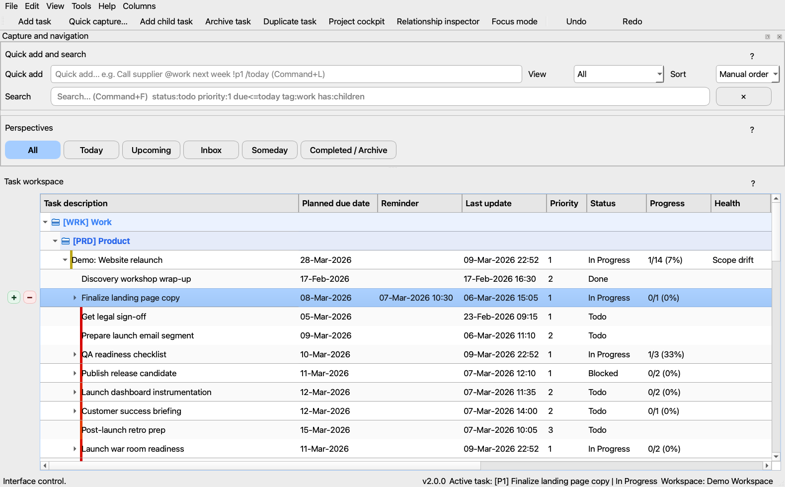
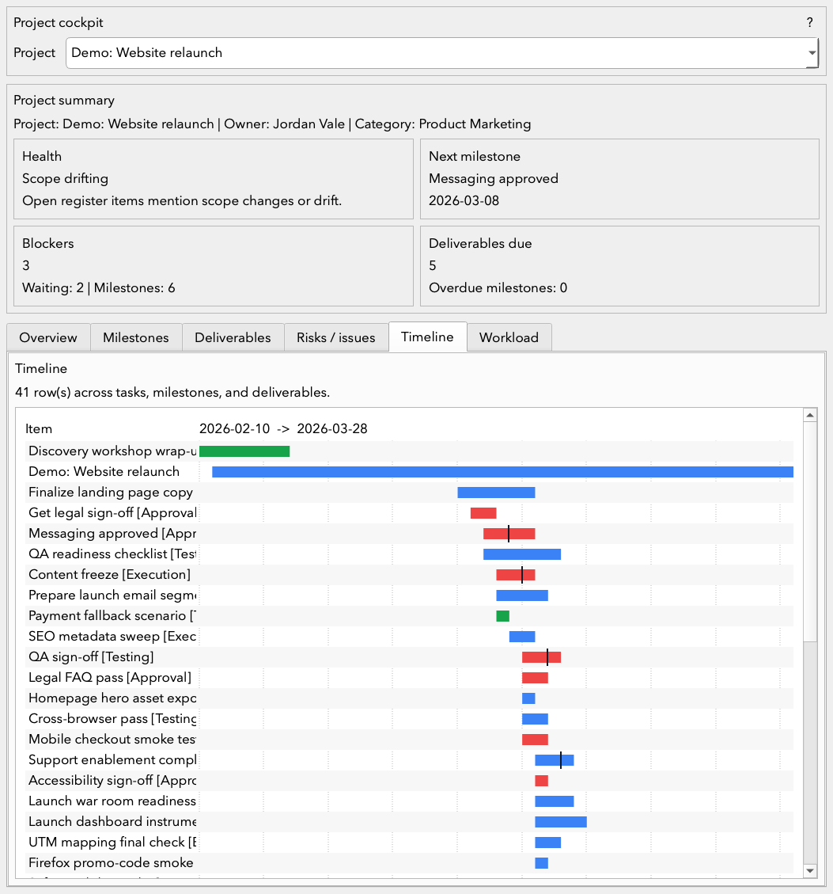
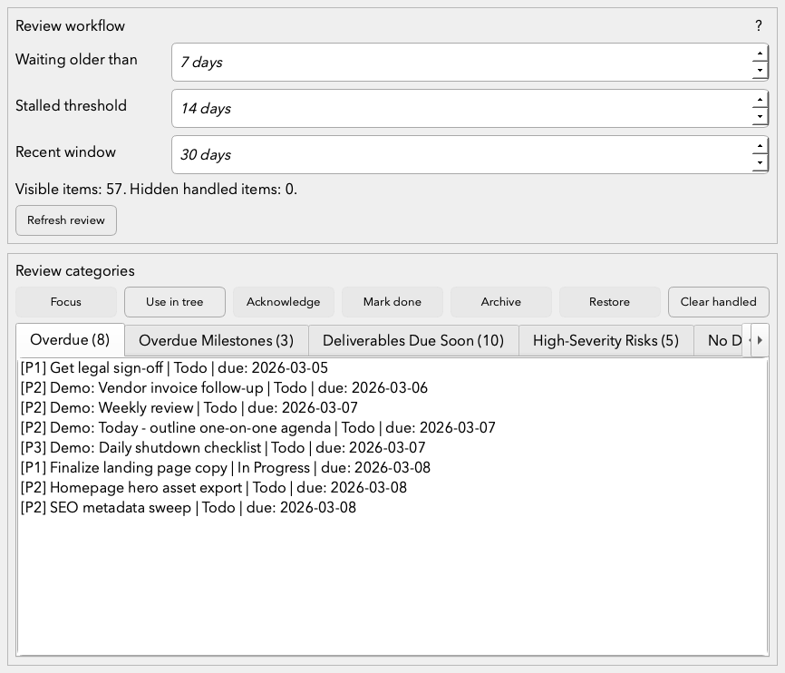
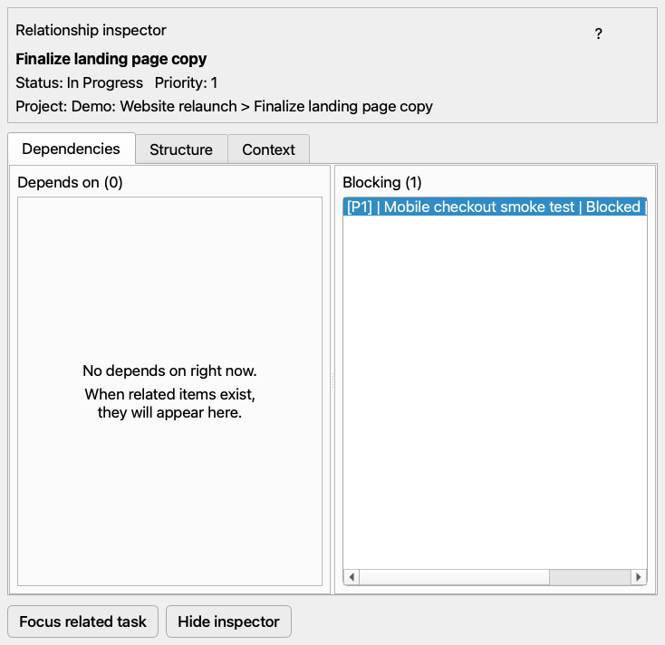

# Gridoryn

Gridoryn is a local-first desktop task and personal project management application built with Python, PySide6, and SQLite.

It combines a fast hierarchical task tree with review workflows, project cockpit planning, diagnostics, backups, and strong offline data ownership. It is designed for a single power user who wants serious planning capability without cloud accounts, team features, or a web backend.

Current stable version: `v2.0.0`

## Why Gridoryn

- Local-first: your data stays on your machine
- Single-user by design: no accounts, sync, SaaS, or collaboration overhead
- Fast keyboard workflow: quick add, quick capture, command palette, saved views
- Serious project planning: phases, milestones, deliverables, baselines, dependencies, workload, and health
- Trust-oriented operations: snapshots, diagnostics, repair previews, logging, and migration validation

## Who It Is For

Gridoryn is for:
- solo operators managing complex personal or client-facing work
- power users who want hierarchy, review, and project clarity in one desktop app
- people who prefer explicit local control over cloud task managers

Gridoryn is not for:
- team collaboration
- cloud sync or multi-device coordination through a hosted service
- enterprise workflow management
- users who want a simple checklist app with minimal planning detail

## Feature Overview

### Core work management
- Hierarchical task tree with parent/child work, drag-and-drop ordering, archive/restore, and undo/redo
- Compact first-cell status strip in the task tree keeps task state scanable without repaint-heavy full-row fills
- Category folders for grouping top-level tasks and projects without turning the folder itself into a task
- Built-in perspectives: All, Today, Upcoming, Inbox, Someday, and Completed / Archive
- Search, filters, saved views, and dense keyboard-first navigation
- Custom columns with typed editors, including dates and editable lists
- Theme customization includes a custom QSS override path, and the embedded guide now documents stable internal selectors and QSS examples for targeted UI restyling
- Notes, tags, reminders, attachments, recurrence, effort, actual time, and waiting context

### Project management
- Project cockpit with project charter/definition fields
- Project phases for intake, planning, execution, testing, approval, and closure
- Milestones, deliverables, baselines, and variance tracking
- Structured risk, issue, assumption, and decision registers
- Interactive timeline / Gantt planning with hierarchy, dependencies, today markers, context menus, zoom, double-click task creation, and direct drag/resize scheduling
- Health indicators, blockers, workload pressure, and next-action support

### Review and visibility
- Guided review workflow for overdue, waiting, stalled, archive, and PM-specific review categories
- Focus mode for short actionable work lists
- Relationship inspector for dependencies, same-project context, and related tasks
- Calendar / agenda view
- Analytics dashboard for completion trends and workload warnings

### Safety and operations
- SQLite schema migrations with validation and pre-migration backup behavior
- Versioned restore-point snapshots
- Backup export/import and theme export/import
- Diagnostics and repair preview flows
- Crash logging, operation logging, and in-app log viewer
- Workspace profiles for multiple local databases

## Screenshots

### Main workspace



The main workspace screenshot reflects the current task-tree rendering: task state is carried by a compact leading strip in the first visible cell, while the rest of the row stays neutral for readability and lower repaint cost.

The embedded guide also now includes a dedicated QSS styling chapter with stable widget/object selectors, syntax examples, and practical starting points for customizing the UI without editing code.

### Project cockpit timeline



### Review workflow



### Relationship inspector



## Quick Start

### Requirements
- Python 3.11 or newer
- `pip`
- a local virtual environment is recommended

### Install

```bash
git clone https://github.com/cosmowyn/Gridoryn.git Gridoryn
cd Gridoryn
python3 -m venv .venv
source .venv/bin/activate
pip install --upgrade pip
pip install -r requirements.txt
```

Windows PowerShell:

```powershell
py -3 -m venv .venv
.\.venv\Scripts\Activate.ps1
pip install --upgrade pip
pip install -r requirements.txt
```

### Run

```bash
python main.py
```

On first launch, Gridoryn can open a Quick Start dialog that lets you:
- start with an empty workspace
- load a full showcase demo into an empty workspace
- open a separate demo workspace
- jump into the embedded guide
- open the review workflow immediately

## Daily Workflow

A typical flow looks like this:

1. Capture with Quick add, Quick capture, or the command palette
2. Organize tasks in the tree, details panel, and perspectives
3. Use saved views, focus mode, and review workflow to stay current
4. Manage project outcomes in the Project cockpit
5. Use diagnostics, snapshots, and logs when you need trust and recovery

## Local Data and Safety

Gridoryn is local-first. User data stays in the per-user application data location managed by Qt.

Stored locally:
- the primary SQLite database
- workspace-specific restore points
- logs
- persistent UI state and settings
- themes

Included safety features:
- schema validation on open
- migration validation and clear failure reporting
- restore-point snapshots with rotation
- diagnostics and repair preview tools
- backup export/import
- application log viewing for failures and high-risk operations

## Demo Workspace

The built-in demo now functions as a real showcase workspace rather than a tiny sample list. It includes:
- four populated projects
- dense timelines and dependencies
- milestones and deliverables
- risk/issue/assumption/decision registers
- reminders and recurrence
- saved views and templates
- attachments, archive data, and workload pressure examples

The demo uses fictionalized data only.

## Build and Packaging

The stable local build helper is [buildfile.py](buildfile.py).

### Build

```bash
pip install -r requirements-dev.txt
python buildfile.py
```

The build helper:
- reads the stable app name and version from [app_metadata.py](app_metadata.py)
- uses the same Python interpreter that launched `buildfile.py`
- uses stable local icon/splash assets automatically when they are present
- supports optional asset overrides through `GRIDORYN_ICON` and `GRIDORYN_SPLASH`
- builds a PyInstaller desktop artifact
- stages a versioned release copy under `dist/release/`
- writes `dist/release_manifest.json`

### Packaging notes
- the stable repo includes a tracked macOS `.icns` icon asset
- macOS icon conversion is handled through `sips` and `iconutil` when needed
- Windows builds can supply a `.ico` through `GRIDORYN_ICON`
- Windows builds also look for a repo-root `icon.ico`
- if no `.ico` is present, the build helper will generate `build_assets/icons/Gridoryn.ico` from `icon.png` when possible
- the build helper verifies `PyInstaller --version` in the current interpreter before building
- the packaged app bundles `build_assets/icons` so the runtime window icon can match the executable icon
- local/private signing material is intentionally excluded from the stable branch and release flow
- the stable PyInstaller spec file is [Gridoryn.spec](Gridoryn.spec)

### Release checklist
- [docs/release-checklist.md](docs/release-checklist.md)

## Testing

The repository includes an automated `pytest` suite covering:
- schema creation and migrations
- backup/import/export
- project-management entities and validation
- filtering and views
- demo data generation
- help routing
- selection synchronization
- diagnostics, restore points, and logging

Run the full suite:

```bash
python -m pytest -q
```

Optional syntax check:

```bash
python -m py_compile *.py tests/*.py
```

## Project Structure

```text
main.py                     Main window and workspace orchestration
db.py                       SQLite schema, migrations, diagnostics, and persistence
model.py                    Tree model and undo-aware operations
project_cockpit_ui.py       Project cockpit UI
project_management.py       PM calculations and timeline/workload logic
relationships_ui.py         Relationship inspector
review_ui.py                Guided review workflow
focus_ui.py                 Focus-mode panel
help_ui.py                  Embedded help system
backup_io.py                Backup import/export
auto_backup.py              Restore-point snapshots
crash_logging.py            Crash and operation logging
demo_data.py                Showcase demo workspace generation
workspace_profiles.py       Multi-workspace local profile handling
buildfile.py                Local build helper
Gridoryn.spec               Stable PyInstaller spec
```

## License

This project is licensed under the PolyForm Noncommercial License 1.0.0 with copyright held by **Mervyn van de Kleut**. Commercial resale and other commercial use are not permitted.
